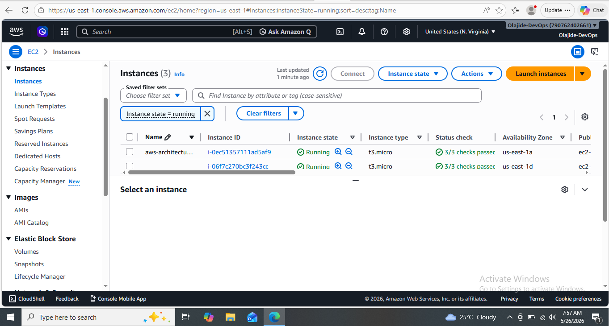
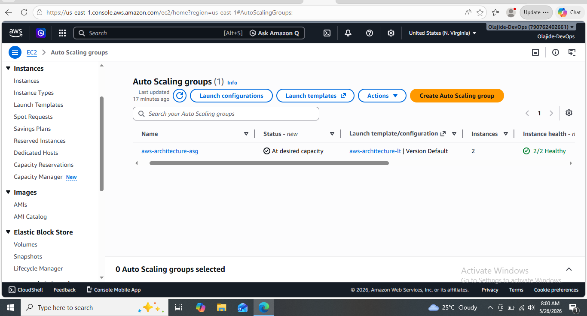
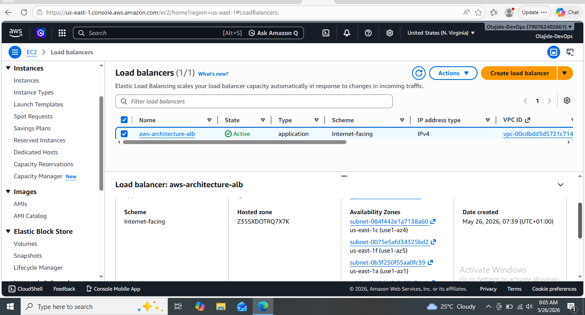
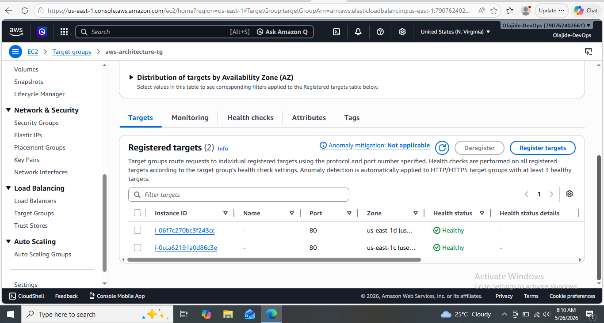
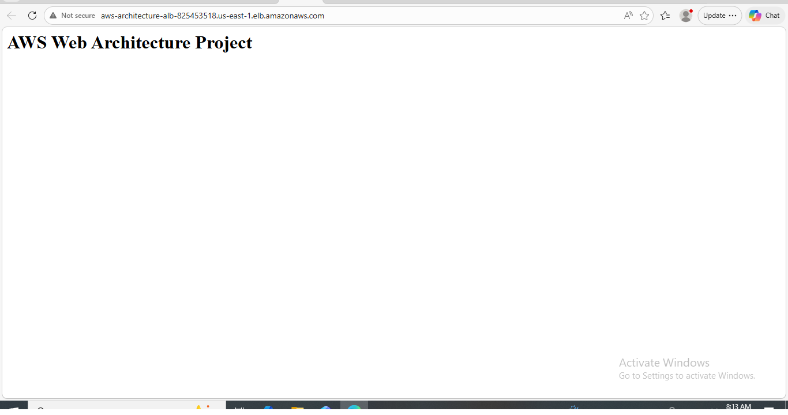
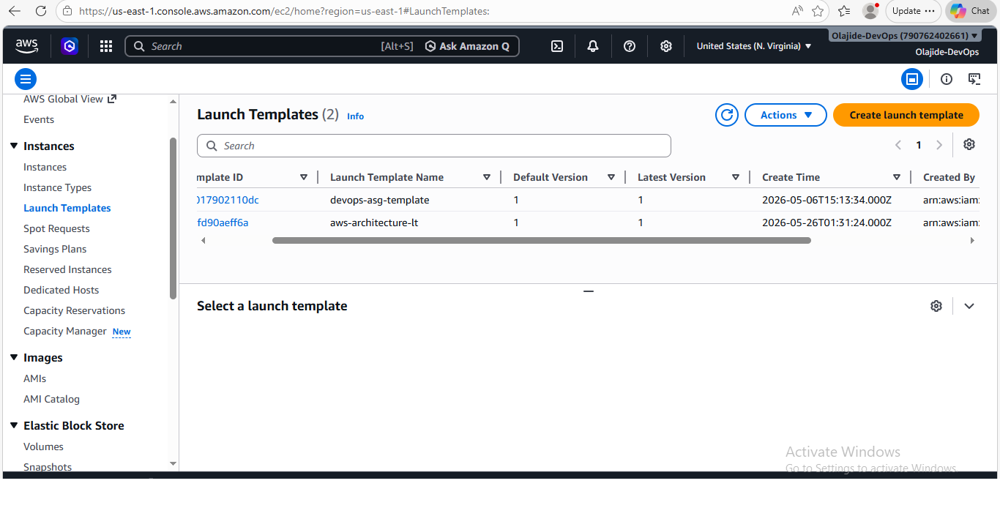
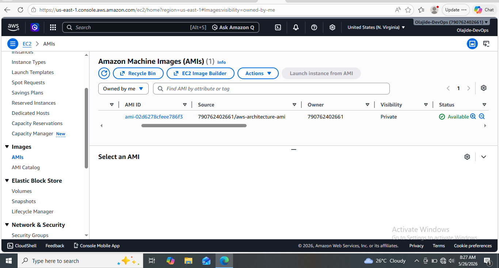

# AWS Web Architecture Project

## 📌 Project Overview
This project demonstrates a production-style AWS web architecture deployment using core AWS cloud services.

The infrastructure was designed to provide:
- High availability
- Scalability
- Load balancing
- Automated server provisioning
- Fault tolerance

---

# 🚀 AWS Services Used

- Amazon EC2
- Amazon Machine Image (AMI)
- Launch Template
- Auto Scaling Group (ASG)
- Application Load Balancer (ALB)
- Target Group
- Security Groups
- Apache Web Server

---

# 🏗️ Architecture Workflow

text
User
   ↓
Application Load Balancer
   ↓
Target Group
   ↓
Auto Scaling Group
   ↓
Multiple EC2 Apache Web Servers

---

# ⚙️ Project Implementation Steps

## 1. Created Security Group
Configured inbound rules for:
- SSH (22)
- HTTP (80)

---

## 2. Launched EC2 Instance
- Amazon Linux 2023
- Apache installed using User Data script
- Web server configured automatically

---

## 3. Created Custom AMI
Generated reusable machine image from configured EC2 instance.

---

## 4. Created Launch Template
Configured:
- AMI
- Instance type
- Security group
- Key pair

---

## 5. Created Auto Scaling Group
Configured:
- Desired capacity = 2
- Minimum capacity = 2
- Maximum capacity = 4

---

## 6. Configured Application Load Balancer
- Internet-facing ALB
- HTTP listener on port 80
- Traffic forwarding to target group

---

# 📸 Project Screenshots

## EC2 Instances

## Auto Scaling Group

## Application Load Balancer

## Target Group Health

## Browser Output

## Launch Template

## Custom AMI

---

# 🎯 Key DevOps Concepts Demonstrated

- Infrastructure automation
- Immutable infrastructure using AMIs
- High availability architecture
- Elastic scaling
- Load balancing
- Cloud monitoring readiness
- Production-style AWS deployment

---

# 📚 Skills Gained

- AWS EC2 Administration
- Auto Scaling Configuration
- Application Load Balancer Setup
- Launch Templates
- Linux Server Administration
- Apache Web Server Deployment
- AWS Networking Basics

---

# 👨‍💻 Author

Olajide Adedayo

AWS Cloud & DevOps Engineer (Learning Journey).
